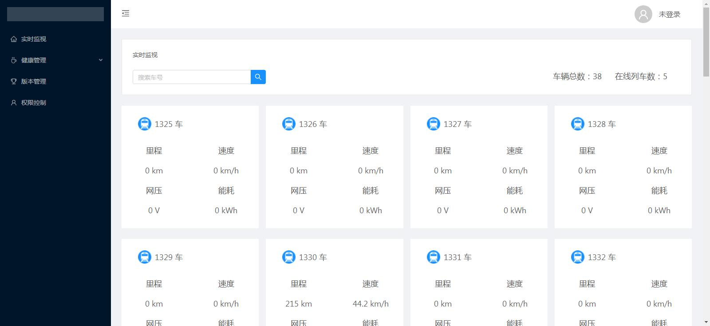
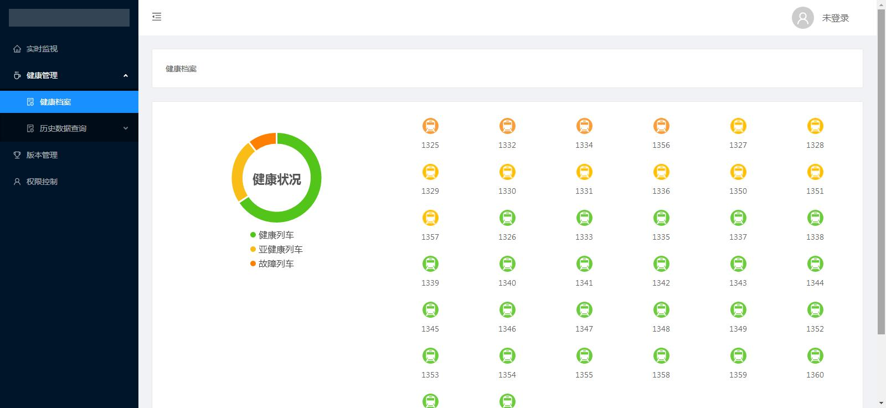
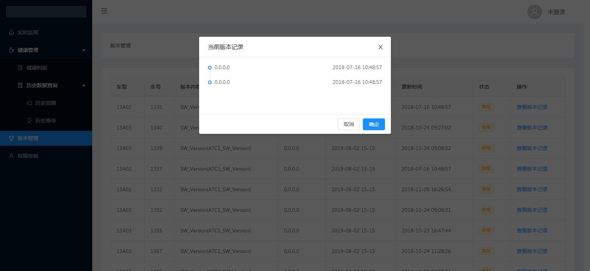
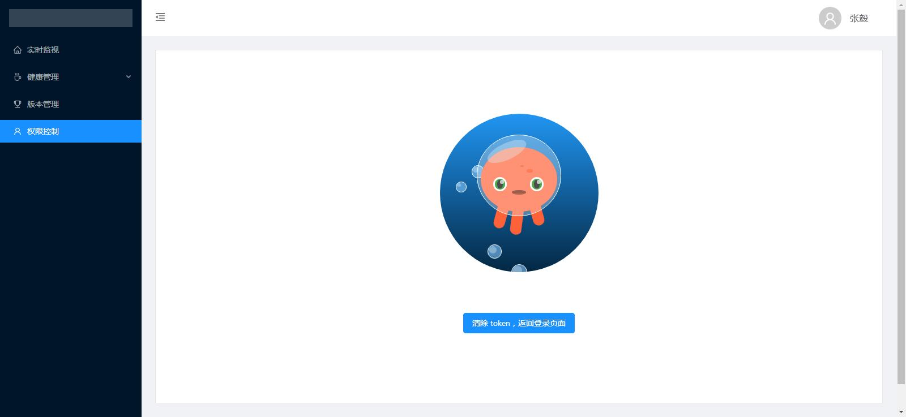

This project was generated with [Angular CLI](https://github.com/angular/angular-cli) version 7.3.5.

## 相关技术

angular@7.2.0 + angular/router@7.2.0 + angular2-websocket@0.9.8 + ng-zorro-antd@1.8.1 + echarts@4.2.1

### 如何运行

npm install

npm start

访问 localhost:4200

### 截图

### 登录

### 实时监视

### 健康管理

### 版本管理

### 权限控制

